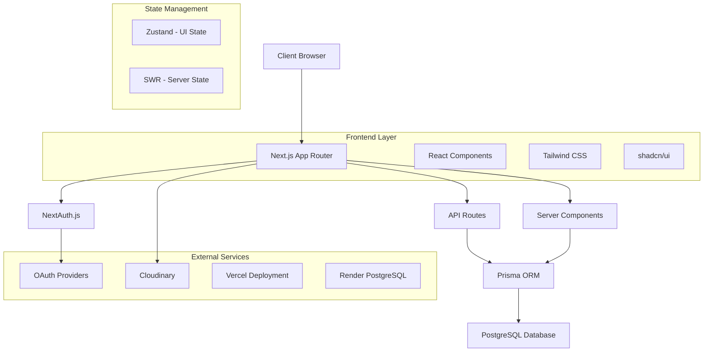

# Design Document

## Overview

The community platform will be built as a modern full-stack web application using Next.js 14 with App Router, providing a scalable and performant social networking experience. The architecture follows a modular approach with clear separation of concerns, utilizing server-side rendering for optimal performance and SEO.

## Architecture

### High-Level Architecture



### Technology Stack Integration

- **Frontend**: Next.js 14 App Router with TypeScript for type safety
- **Styling**: Tailwind CSS v4 with shadcn/ui component library
- **Authentication**: NextAuth.js with Google, GitHub, and credentials providers
- **Database**: PostgreSQL hosted on Render with Prisma ORM
- **State Management**: Zustand for client state, SWR for server state caching
- **File Storage**: Cloudinary for image uploads and optimization
- **Deployment**: Vercel for frontend, Render for database

## Components and Interfaces

### Core Components Structure

```
src/
├── components/
│   ├── ui/                 # shadcn/ui base components
│   ├── auth/              # Authentication components
│   ├── feed/              # Social feed components
│   ├── profile/           # User profile components
│   ├── admin/             # Admin dashboard components
│   ├── notifications/     # Notification components
│   └── layout/            # Layout and navigation
├── hooks/                 # Custom React hooks
├── lib/                   # Utility functions and configurations
├── app/                   # Next.js App Router pages
└── types/                 # TypeScript type definitions
```

### Key Component Interfaces

#### Authentication Components
- `LoginForm`: Handles multiple auth providers
- `SignupForm`: User registration with validation
- `AuthProvider`: Context for authentication state
- `ProtectedRoute`: Route protection wrapper

#### Feed Components
- `FeedContainer`: Main feed layout and infinite scroll
- `PostCard`: Individual post display with interactions
- `PostComposer`: Create new posts interface
- `CommentSection`: Comments display and creation

#### Profile Components
- `ProfileHeader`: User info, avatar, and social links
- `ProfileEditor`: Edit profile information
- `UserPosts`: Display user's post history
- `FollowButton`: Follow/unfollow functionality

### API Route Structure

```
app/api/
├── auth/                  # NextAuth configuration
├── posts/                 # Post CRUD operations
├── users/                 # User management
├── comments/              # Comment operations
├── notifications/         # Notification system
├── admin/                 # Admin operations
└── upload/                # File upload handling
```

## Data Models

### Database Schema

```prisma
model User {
  id            String    @id @default(cuid())
  email         String    @unique
  name          String?
  image         String?
  bio           String?
  socialLinks   Json?
  role          Role      @default(USER)
  createdAt     DateTime  @default(now())
  updatedAt     DateTime  @updatedAt
  
  posts         Post[]
  comments      Comment[]
  likes         Like[]
  followers     Follow[]  @relation("UserFollowers")
  following     Follow[]  @relation("UserFollowing")
  notifications Notification[]
  
  @@map("users")
}

model Post {
  id        String   @id @default(cuid())
  content   String
  imageUrl  String?
  authorId  String
  createdAt DateTime @default(now())
  updatedAt DateTime @updatedAt
  
  author    User      @relation(fields: [authorId], references: [id], onDelete: Cascade)
  comments  Comment[]
  likes     Like[]
  
  @@map("posts")
}

model Comment {
  id        String   @id @default(cuid())
  content   String
  postId    String
  authorId  String
  createdAt DateTime @default(now())
  
  post      Post @relation(fields: [postId], references: [id], onDelete: Cascade)
  author    User @relation(fields: [authorId], references: [id], onDelete: Cascade)
  
  @@map("comments")
}

model Like {
  id     String @id @default(cuid())
  postId String
  userId String
  
  post   Post @relation(fields: [postId], references: [id], onDelete: Cascade)
  user   User @relation(fields: [userId], references: [id], onDelete: Cascade)
  
  @@unique([postId, userId])
  @@map("likes")
}

model Follow {
  id          String @id @default(cuid())
  followerId  String
  followingId String
  createdAt   DateTime @default(now())
  
  follower    User @relation("UserFollowing", fields: [followerId], references: [id], onDelete: Cascade)
  following   User @relation("UserFollowers", fields: [followingId], references: [id], onDelete: Cascade)
  
  @@unique([followerId, followingId])
  @@map("follows")
}

model Notification {
  id        String           @id @default(cuid())
  type      NotificationType
  message   String
  read      Boolean          @default(false)
  userId    String
  createdAt DateTime         @default(now())
  
  user      User @relation(fields: [userId], references: [id], onDelete: Cascade)
  
  @@map("notifications")
}

enum Role {
  USER
  ADMIN
}

enum NotificationType {
  LIKE
  COMMENT
  FOLLOW
}
```

### Zod Validation Schemas

```typescript
// User validation
export const userSchema = z.object({
  name: z.string().min(1).max(50),
  bio: z.string().max(500).optional(),
  socialLinks: z.object({
    twitter: z.string().url().optional(),
    github: z.string().url().optional(),
    linkedin: z.string().url().optional(),
  }).optional(),
});

// Post validation
export const postSchema = z.object({
  content: z.string().min(1).max(2000),
  imageUrl: z.string().url().optional(),
});

// Comment validation
export const commentSchema = z.object({
  content: z.string().min(1).max(1000),
  postId: z.string().cuid(),
});
```

## Error Handling

### Client-Side Error Handling
- React Error Boundaries for component-level errors
- Form validation with real-time feedback using react-hook-form
- Toast notifications for user feedback using shadcn/ui Toast component
- Loading states and skeleton components for better UX

### Server-Side Error Handling
- Centralized error handling middleware for API routes
- Structured error responses with appropriate HTTP status codes
- Database connection error handling with retry logic
- Authentication error handling with proper redirects

### Error Response Format
```typescript
interface ApiError {
  success: false;
  error: {
    code: string;
    message: string;
    details?: any;
  };
}

interface ApiSuccess<T> {
  success: true;
  data: T;
}
```

## Testing Strategy

### Unit Testing
- Jest + React Testing Library for component testing
- Test utilities for mocking authentication and database
- Snapshot testing for UI components
- Custom hooks testing with @testing-library/react-hooks

### Integration Testing
- API route testing with Next.js test utilities
- Database integration tests with test database
- Authentication flow testing
- File upload testing with mocked Cloudinary

### E2E Testing (Optional)
- Playwright for critical user journeys
- Authentication flows
- Post creation and interaction flows
- Admin dashboard functionality

### Test Structure
```
__tests__/
├── components/           # Component unit tests
├── hooks/               # Custom hooks tests
├── pages/               # Page integration tests
├── api/                 # API route tests
└── utils/               # Utility function tests
```

## Performance Optimizations

### Frontend Optimizations
- Server-side rendering with Next.js App Router
- Image optimization with Next.js Image component and Cloudinary
- Code splitting and lazy loading for non-critical components
- SWR for efficient data fetching and caching
- Infinite scroll implementation for feed performance

### Backend Optimizations
- Database query optimization with Prisma
- Connection pooling for database connections
- Caching strategies for frequently accessed data
- API rate limiting to prevent abuse
- Image compression and CDN delivery via Cloudinary

### SEO and Accessibility
- Meta tags and Open Graph optimization
- Semantic HTML structure
- ARIA labels and keyboard navigation
- Color contrast compliance
- Screen reader compatibility

## Security Considerations

### Authentication Security
- Secure session management with NextAuth.js
- Password hashing with bcrypt (minimum 12 rounds)
- CSRF protection built into Next.js
- Secure cookie configuration

### API Security
- Input validation with Zod schemas
- SQL injection prevention with Prisma
- Rate limiting on API endpoints
- Authentication middleware for protected routes

### Data Protection
- Environment variable management
- Secure file upload validation
- XSS prevention with proper sanitization
- Content Security Policy headers

## Deployment Architecture

### Vercel Deployment
- Automatic deployments from Git
- Environment variable management
- Edge function optimization
- Preview deployments for testing

### Database Deployment
- PostgreSQL on Render with automated backups
- Connection pooling configuration
- Migration management with Prisma
- Environment-specific database configurations

### Monitoring and Logging
- Vercel Analytics for performance monitoring
- Error tracking with built-in Next.js error reporting
- Database query monitoring
- User activity logging for admin insights